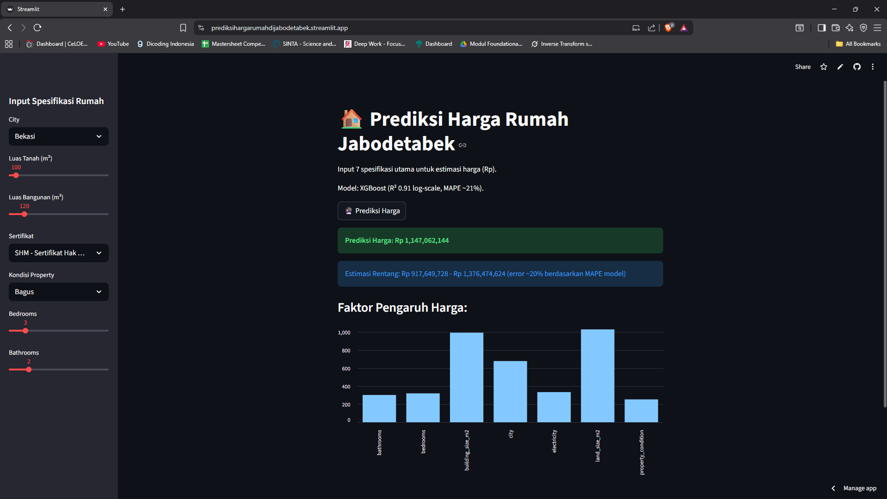

# 🏠 Prediksi Harga Rumah Jabodetabek

  

App web interaktif untuk estimasi harga rumah di Jabodetabek menggunakan model XGBoost. Dibangun dari data real Rumah123 (3.553 sampel), dengan akurasi tinggi: **R² 0.91 (log-scale)** dan **MAPE ~21%**. Input sederhana seperti luas tanah, jumlah kamar, kondisi properti—output harga Rp akurat plus rentang estimasi!

**Live Demo**: [Coba App Sekarang!](https://prediksihargarumahdijabodetabek.streamlit.app/)  
*(Atau deploy sendiri dari repo ini!)*

 <!-- Upload screenshot app lo di repo, ganti path ini -->

