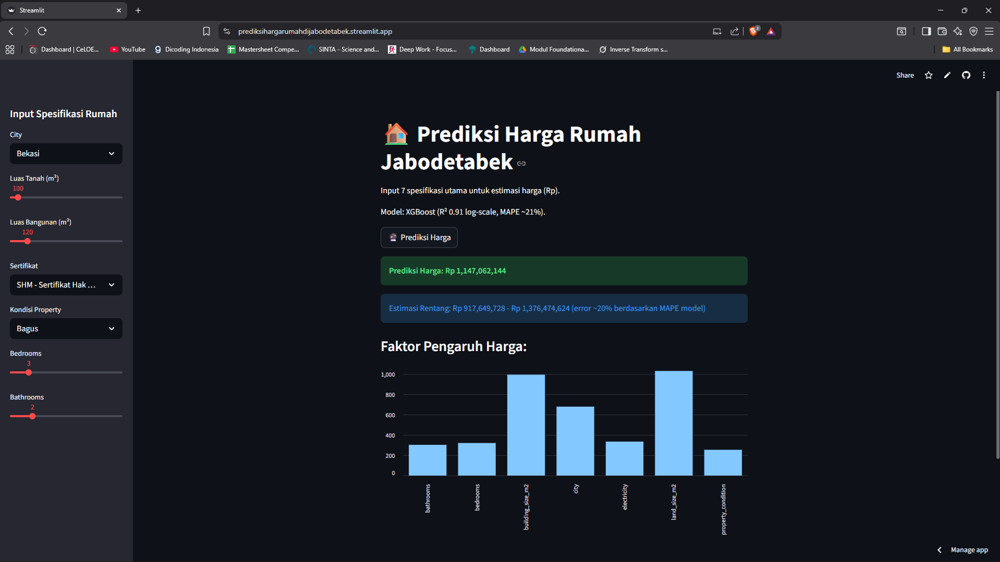
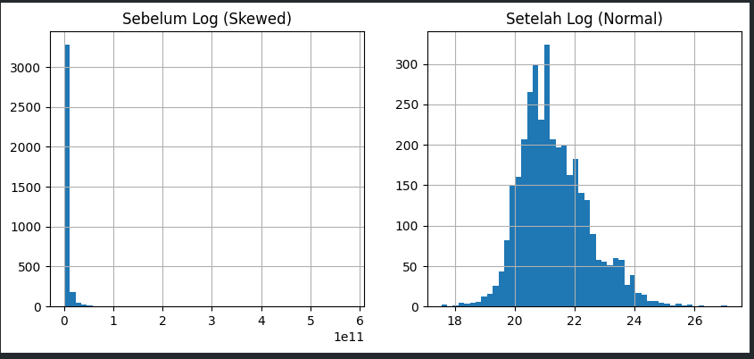

# 🏠 Prediksi Harga Rumah Jabodetabek

<div align="center">



**Estimasi harga properti berbasis data science menggunakan XGBoost Regressor**

[](https://prediksihargarumahdijabodetabek.streamlit.app/)
&nbsp;&nbsp;


</div>

---

## 📌 Tujuan Proyek

Membeli rumah adalah salah satu keputusan finansial terbesar dalam hidup seseorang. Namun, menentukan apakah harga sebuah rumah sudah wajar atau terlalu mahal seringkali sulit karena banyaknya faktor yang saling mempengaruhi — mulai dari lokasi, luas bangunan, hingga kelengkapan sertifikat.

**Proyek ini dibangun untuk menjawab pertanyaan sederhana:**

> *"Berapa harga wajar sebuah rumah di Jabodetabek berdasarkan spesifikasinya?"*

### Secara spesifik, tujuan proyek ini adalah:

1. **Menganalisis faktor-faktor penentu harga rumah** di Jabodetabek menggunakan data listing properti nyata dari [Rumah123](https://www.rumah123.com/).
2. **Membangun model prediktif** yang mampu memberikan estimasi harga pasar berdasarkan fitur-fitur properti seperti lokasi, luas tanah, jumlah kamar, dll.
3. **Menyediakan dashboard interaktif** agar pengguna awam sekalipun bisa mendapatkan estimasi harga tanpa perlu memahami teknis data science.
4. **Memberikan insight** tentang fitur mana yang paling berpengaruh terhadap harga properti di masing-masing wilayah Jabodetabek.

---

## 📊 Dataset

| Aspek | Detail |
|---|---|
| **Sumber** | Web scraping dari [Rumah123.com](https://www.rumah123.com/) |
| **Jumlah Data** | **3.553** listing properti |
| **Cakupan Wilayah** | Jakarta, Bekasi, Depok, Tangerang, Bogor (Jabodetabek) |
| **Kolom Awal** | 27 fitur (termasuk URL, koordinat, fasilitas, dll.) |
| **Kolom Setelah Seleksi** | 14 fitur yang relevan untuk pemodelan |
| **Rentang Harga** | Rp 42 Juta — ratusan Miliar (sangat bervariasi) |

### Fitur yang Digunakan dalam Model

| Fitur | Tipe | Deskripsi |
|---|---|---|
| `city` | Kategorikal | Kota/kabupaten (Jakarta Barat, Jakarta Pusat, Jakarta Selatan, Jakarta Timur, Jakarta Utara, Bekasi, Depok, Tangerang, Bogor) |
| `bedrooms` | Numerik | Jumlah kamar tidur |
| `bathrooms` | Numerik | Jumlah kamar mandi |
| `land_size_m2` | Numerik | Luas tanah dalam m² |
| `building_size_m2` | Numerik | Luas bangunan dalam m² |
| `carports` | Numerik | Jumlah carport |
| `certificate` | Kategorikal | Jenis sertifikat (SHM, HGB, Lainnya) |
| `electricity` | Numerik | Daya listrik (VA) |
| `maid_bedrooms` | Numerik | Jumlah kamar pembantu |
| `maid_bathrooms` | Numerik | Jumlah kamar mandi pembantu |
| `property_condition` | Kategorikal | Kondisi properti (Baru, Bagus, Bagus Sekali, Sudah Renovasi, Butuh Renovasi) |
| `garages` | Numerik | Jumlah garasi |
| `furnishing` | Kategorikal | Status furnishing |

---

## 🔬 Metodologi & Pipeline

```
Raw Data (27 kolom)
    │
    ▼
┌─────────────────────────────────┐
│  1. Data Cleaning               │
│  • Drop kolom tidak relevan     │
│    (URL, title, lat/long, dll.) │
│  • Handle missing values:       │
│    - Kategorikal → Mode         │
│    - Numerik → Median           │
│  • Extract angka dari listrik   │
│  • Cek duplikasi (0 duplikat)   │
└─────────────────────────────────┘
    │
    ▼
┌─────────────────────────────────┐
│  2. Feature Engineering         │
│  • Label Encoding untuk:        │
│    city, certificate,           │
│    property_condition,          │
│    furnishing                   │
│  • Log Transform (log1p) pada   │
│    target variable (harga)      │
│    untuk mengatasi right-skew   │
└─────────────────────────────────┘
    │
    ▼
┌─────────────────────────────────┐
│  3. EDA (Exploratory Data       │
│     Analysis)                   │
│  • Distribusi harga             │
│  • Boxplot outlier detection    │
│  • Correlation heatmap          │
│  • Feature vs target analysis   │
└─────────────────────────────────┘
    │
    ▼
┌─────────────────────────────────┐
│  4. Modeling                    │
│  • Train/Test Split (80:20)     │
│    - Train: 2.842 data          │
│    - Test:    711 data          │
│  • Model 1: XGBoost Regressor   │
│  • Model 2: Random Forest       │
│  • Evaluasi: MSE, MAE, R²      │
└─────────────────────────────────┘
    │
    ▼
┌─────────────────────────────────┐
│  5. Deployment                  │
│  • Model disimpan (.pkl)        │
│  • Dashboard Streamlit          │
│  • Deploy ke Streamlit Cloud    │
└─────────────────────────────────┘
```

### Mengapa Log Transformation?

Distribusi harga rumah di Jabodetabek sangat *right-skewed* — sebagian besar rumah berharga di bawah Rp 5M, namun beberapa rumah mewah bisa mencapai ratusan miliar. Tanpa transformasi, model akan bias terhadap outlier harga tinggi.



Dengan `log1p()`, distribusi menjadi lebih mendekati normal, sehingga model bisa belajar pola harga dengan lebih stabil baik untuk rumah subsidi maupun rumah premium.

---

## 📈 Hasil & Evaluasi Model

### Perbandingan Model (Log-Scale)

| Metrik | XGBoost | Random Forest |
|---|:---:|:---:|
| **MSE** | 0.1105 | 0.1180 |
| **MAE** | 0.2043 | 0.2012 |
| **R² Score** | **0.9112** ✅ | 0.9052 |

### Perbandingan Model (Rupiah Asli)

| Metrik | XGBoost | Random Forest |
|---|:---:|:---:|
| **MAE** | ~Rp 1.34 Miliar | ~Rp 1.40 Miliar |
| **R² Score** | **0.5715** | 0.5477 |

### Interpretasi

- **R² = 0.91 (log-scale)** → Model mampu menjelaskan **91% variasi harga** rumah di Jabodetabek. Ini merupakan skor yang sangat kuat.
- **MAPE ≈ 21%** → Rata-rata error prediksi sekitar 21% dari harga sebenarnya. Untuk pasar properti yang sangat heterogen, ini masih dalam batas wajar.
- **XGBoost mengungguli Random Forest** di hampir semua metrik, sehingga dipilih sebagai model final.
- R² yang lebih rendah di Rupiah asli (0.57) wajar karena inverse transform memperbesar error pada harga-harga ekstrem (rumah sangat mahal/murah).

---

## 💡 Insight & Temuan Utama

### 🏆 Top Faktor Penentu Harga

Berdasarkan analisis **feature importance** dari model XGBoost:

| Peringkat | Faktor | Insight |
|:---:|---|---|
| 🥇 | **Luas Tanah** (`land_size_m2`) | Faktor paling dominan — setiap penambahan m² luas tanah berkontribusi besar terhadap kenaikan harga |
| 🥈 | **Luas Bangunan** (`building_size_m2`) | Berkorelasi kuat dengan harga; rumah dengan bangunan lebih besar cenderung jauh lebih mahal |
| 🥉 | **Lokasi Kota** (`city`) | Jakarta konsisten memiliki harga tertinggi, diikuti Tangerang, sementara Bogor relatif paling terjangkau |
| 4 | **Daya Listrik** (`electricity`) | Proxy tidak langsung untuk ukuran dan kelas rumah — listrik 5.500+ VA umumnya rumah premium |
| 5 | **Kondisi Properti** (`property_condition`) | Rumah baru/renovasi dihargai ~15-25% lebih tinggi dibanding rumah yang butuh renovasi |

### 📍 Insight per Wilayah

- **Jakarta** — Harga rata-rata tertinggi. Didominasi rumah dengan sertifikat SHM dan daya listrik tinggi.
- **Bogor** — Wilayah paling terjangkau. Mayoritas listing berharga di bawah Rp 2M.
- **Bekasi & Tangerang** — Menjadi "sweet spot" dengan variasi harga yang lebar, dari rumah subsidi hingga cluster premium.
- **Depok** — Karakteristik harga mirip dengan Bogor, namun dengan rata-rata sedikit lebih tinggi karena proximity ke Jakarta.

### 📜 Pengaruh Sertifikat

Jenis sertifikat memberikan *boost* harga yang signifikan:
- **SHM (Sertifikat Hak Milik)** → Harga tertinggi (kepemilikan penuh, paling diminati)
- **HGB (Hak Guna Bangunan)** → Harga menengah
- **Lainnya (PPJB, Girik, dll.)** → Harga terendah (risiko hukum lebih tinggi)

---

## 🖥️ Fitur Dashboard

Dashboard interaktif dibangun menggunakan **Streamlit** dan menyediakan:

| Fitur | Deskripsi |
|---|---|
| 🔮 **Prediksi Harga** | Input spesifikasi rumah dan dapatkan estimasi harga instan |
| 📊 **Insight & Analisis** | Visualisasi feature importance — faktor apa yang paling mempengaruhi harga |
| 💰 **Rentang Harga** | Estimasi rentang harga wajar (±20%) untuk ruang negosiasi |
| ⚡ **Real-time** | Prediksi dihitung secara langsung menggunakan model yang sudah dilatih |

**🌐 Coba Sekarang:** [prediksihargarumahdijabodetabek.streamlit.app](https://prediksihargarumahdijabodetabek.streamlit.app/)

---

## 🛠️ Instalasi & Menjalankan Lokal

### Prasyarat
- Python 3.10 atau lebih baru
- pip (package manager)

### Langkah-Langkah

```bash
# 1. Clone repository
git clone https://github.com/varelsaurus/prediksi_harga_rumah.git
cd prediksi_harga_rumah

# 2. (Opsional) Buat virtual environment
python -m venv venv
source venv/bin/activate        # Linux/Mac
venv\Scripts\activate           # Windows

# 3. Install dependencies
pip install -r requirements.txt

# 4. Jalankan dashboard
streamlit run app.py
```

Dashboard akan terbuka secara otomatis di browser pada `http://localhost:8501`.

---

## 📁 Struktur Proyek

```
prediksi_harga_rumah/
├── app.py                  # Kode dashboard Streamlit
├── notebook.ipynb          # Jupyter Notebook (EDA, training, evaluasi)
├── xgb_house_model.pkl     # Model XGBoost yang sudah dilatih
├── requirements.txt        # Daftar dependensi Python
├── images/
│   ├── overview.png        # Screenshot dashboard
│   └── before-after.png    # Visualisasi log transformation
└── README.md               # Dokumentasi proyek (file ini)
```

---

## 🧰 Tech Stack

| Kategori | Teknologi |
|---|---|
| **Bahasa** | Python 3.10+ |
| **Machine Learning** | XGBoost, Scikit-learn, Random Forest |
| **Data Processing** | Pandas, NumPy |
| **Visualisasi** | Matplotlib, Seaborn |
| **Dashboard** | Streamlit |
| **Deployment** | Streamlit Cloud |

---

## ⚠️ Limitasi & Disclaimer

- Estimasi harga bersifat **prediktif** dan dapat berbeda dengan harga aktual di lapangan.
- Model dilatih menggunakan data listing dari Rumah123 yang mungkin tidak mencerminkan harga transaksi sebenarnya.
- Faktor-faktor seperti lokasi spesifik (nama perumahan/cluster), akses jalan, dan kedekatan dengan fasilitas umum **belum** dimasukkan ke dalam model.
- Performa model lebih baik untuk rumah di rentang harga Rp 500 Juta — Rp 10 Miliar (mayoritas data training).

---

## 🚀 Pengembangan Selanjutnya

- [ ] Menambahkan data dari platform properti lain (OLX Property, 99.co)
- [ ] Feature engineering lanjutan (harga per m², rasio bangunan/tanah)
- [ ] Hyperparameter tuning dengan Optuna/GridSearch
- [x] Menambahkan fitur lokasi spesifik (Kini mendukung pembagian 5 wilayah Jakarta secara detail pada dashboard)
- [ ] Implementasi model ensemble (stacking XGBoost + Random Forest)

---

<div align="center">

**Dibuat oleh [Varel](https://github.com/varelsaurus)** · 2025

Sumber Data: [Rumah123](https://www.rumah123.com/) · Model: XGBoost v1.2

</div>
